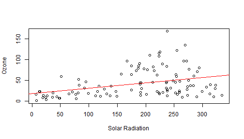

## Summary:

The aim of this presentation was to make a shiny application to obtain predicted values
for air-quality parameters using linear regression. The application use the AirQuality `R` 
dataset (obtained from New York city). 
 
    

```
##   Ozone Solar.R Wind Temp Month Day
## 1    41     190  7.4   67     5   1
## 2    36     118  8.0   72     5   2
## 3    12     149 12.6   74     5   3
## 4    18     313 11.5   62     5   4
## 5    NA      NA 14.3   56     5   5
## 6    28      NA 14.9   66     5   6
```

--- .class #id 

## The User Interface; selecting measurements:

This application allow select and compare two measurements from two SelectBox: 

    - A measurement to predict her value (outcome).
    - A measurement used as Predictor (Predictor).

The User interface is splited in two panels:

    - Left-Hand panel : Allow select both measurement and fix a Predictor value from
                        a SliderBar control.
    - Right-hand panel: Show the predicted value an a plot that show the relationship 
                        between the measurements selected (outcome and predictor).

--- .class #id 

## Drawing the Plot; making a linear model. 

With the measurements, the application automatically obtain a linear model 
and fits a regression line for the selected variables drawing a plot.  

    This example shows the code for plot obtained comparing Solar Radiation against Ozone.  
    

```r
fit <- lm(Ozone ~ Solar.R, data=airquality)
plot(Ozone ~ Solar.R, data = airquality, xlab="Solar Radiation", ylab="Ozone")
abline(fit, col="red")
```

 


--- .class #id 

## Making predictions. 

Finally with the value fixed from SliderBar control, the application can to extrapolate a
predicted value based on the coefficients obtained for the linear model that is fitted to the plot.


```r
sliderInput <- 75
fit <- lm(Ozone ~ Solar.R, data=airquality)
slp <- fit$coeff[2]
yint <- fit$coeff[1]
prediction <- round(yint + slp * sliderInput,2)
prediction
```

```
## (Intercept) 
##       28.14
```
